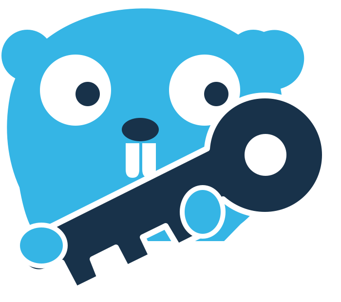
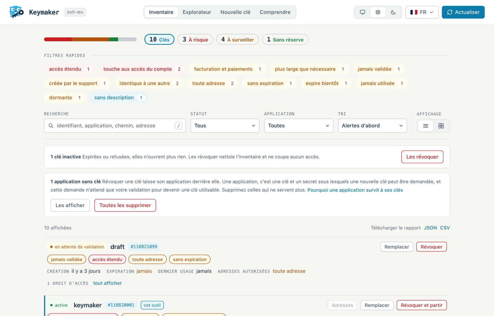

<p align="center">
  
</p>

<h1 align="center">Keymaker</h1>

<p align="center">
  <a href="https://github.com/kentrow/keymaker/actions/workflows/ci.yml"></a>
  <a href="https://github.com/kentrow/keymaker/releases/latest"></a>
  <a href="LICENSE"></a>
  <a href="https://scorecard.dev/viewer/?uri=github.com/kentrow/keymaker"></a>
</p>

<p align="center">
  Une interface web locale pour inventorier, auditer, révoquer et créer des clés d’API OVHcloud.
</p>

<p align="center">
  <a href="README.md">English</a> · Français
</p>

> [!IMPORTANT]
> Keymaker est un projet indépendant. Il n’est ni affilié à OVHcloud, ni approuvé ou sponsorisé
> par OVHcloud. OVHcloud est une marque de son propriétaire, citée ici uniquement pour
> identifier l’API avec laquelle l’outil fonctionne.

<p align="center">
  <picture>
    <source media="(prefers-color-scheme: dark)" srcset="docs/images/inventory-fr-dark.png">
    
  </picture>
</p>

<p align="center">
  L’inventaire, capturé avec <code>make demo</code> : chaque clé, nom et adresse y est inventé.
</p>

## Fonctionnalités

Keymaker gère les clés d’API OVHcloud classiques : une clé d’application, un secret
d’application et une consumer key.

- **Inventaire** de toutes les clés du compte, avec leurs droits d’accès, leurs adresses
  autorisées, leurs dates de création, d’expiration et de dernier usage, et l’application à
  laquelle elles appartiennent, y compris les applications que le compte ne possède pas, comme
  la console API OVHcloud. La clé utilisée par Keymaker est signalée, et chaque droit qu’elle
  porte au-delà de ce dont Keymaker a besoin est nommé. Une clé dont l’application a été
  supprimée, qu’OVHcloud continue de lister comme active, est montrée comme n’ouvrant plus rien.
  L’inventaire entier, avec ses constats, se télécharge en rapport JSON ou CSV, qui ne contient
  aucune valeur de clé.
- **Audit** qui signale les clés qui atteignent tout le compte, peuvent en modifier les accès
  ou atteignent la facturation et les paiements, fonctionnent depuis n’importe quelle adresse,
  n’expirent jamais ou expirent dans moins d’une semaine, n’ont jamais servi, dorment depuis six
  mois, ont été créées par le support OVHcloud plutôt que par vous, n’ont jamais été validées,
  sont indiscernables d’une autre clé de la même application, ou n’ont pas de description, et
  les range en « à risque », « à surveiller » et « sans réserve ».
- **Explorateur de routes** sur toute l’API publiée, cherchable par route ou par usage, pour
  composer un jeu de droits d’accès, avec une alerte quand un droit porte sur tout le compte,
  peut en modifier les accès, ou atteint la facturation et les paiements.
- **Création de clés** via la page OVHcloud `createToken`, ouverte avec les droits choisis déjà
  remplis. Les valeurs de la nouvelle clé ne passent jamais par Keymaker.
- **Remplacement** d’une clé dont les droits ne conviennent plus, puisque l’API ne sait pas
  modifier les droits d’une clé existante. Les droits de l’ancienne clé servent de point de
  départ, ses adresses autorisées sont listées pour être ressaisies, et sa révocation est la
  dernière étape.
- **Adresses autorisées** d’une clé existante modifiées sur place, la seule chose d’une clé que
  l’API laisse modifier. La liste est montrée telle qu’OVHcloud l’enregistrera avant d’être
  enregistrée, et la clé qu’utilise Keymaker n’est jamais restreinte qu’à une liste qui couvre
  l’adresse depuis laquelle il est vu : une clé restreinte hors de sa propre adresse ne peut même
  plus revenir en arrière.
- **Révocation** après saisie de l’identifiant de la clé, et en une passe pour toutes les clés
  expirées ou refusées. La clé qu’utilise Keymaker n’est jamais révoquée par erreur : elle a sa
  propre sortie, révoquer et partir, pour quand vous en avez fini avec l’outil.
- **Applications restées sans clé**, qu’aucun inventaire de clés ne peut montrer. Révoquer une
  clé laisse son application derrière elle, et une application reste une clé et un secret sous
  lesquels une nouvelle clé peut être demandée. Elles se suppriment depuis l’outil ; une
  application qui porte encore une clé ne l’est jamais, car OVHcloud révoquerait cette clé
  avec elle. La suppression se fait une par une ou en une passe pour toutes.
- **Un écran Comprendre** qui pose ce que sont une application, une clé et un droit d’accès,
  sur un exemple inventé, et ce qui en découle : pourquoi une révocation laisse une application
  derrière elle, pourquoi les droits ne se modifient pas, et pourquoi certaines applications ne
  se suppriment pas depuis l’outil.
- **Rien n’est écrit sur disque** : aucune base, aucun cache, et un fichier de configuration
  monté en lecture seule.
- Interface en anglais et en français, thèmes clair et sombre, affichage en liste ou en cartes.

## Modèle de sécurité

En bref, avec le détail dans [docs/ARCHITECTURE.md](docs/ARCHITECTURE.md#security-model) et la
politique de signalement dans [SECURITY.md](SECURITY.md) (en anglais) :

- Keymaker est un outil local et mono-utilisateur. Toute personne qui atteint l’interface peut
  agir avec sa clé de gestion : il écoute donc sur `127.0.0.1`, et le port du conteneur doit
  être publié sur `127.0.0.1` uniquement.
- Un jeton d’accès aléatoire est généré à chaque démarrage et affiché une fois dans l’adresse à
  ouvrir. Toutes les routes sauf `GET /healthz` l’exigent.
- Chaque modification exige aussi un second jeton, illisible depuis une autre origine.
- La politique de sécurité du contenu n’autorise rien que le binaire ne serve lui-même.
- Le secret d’application et la consumer key sont masqués dans toutes les lignes de log.
- Rien n’est persisté, et les clés créées n’atteignent jamais le processus.
- Les seuls hôtes contactés sont l’API OVHcloud et, quand vous demandez votre adresse publique
  ou restreignez la clé qu’utilise Keymaker, `api.ipify.org`. `KEYMAKER_IP_LOOKUP=off` supprime
  ce dernier.

## Démarrage rapide

### 1. Créer la clé de gestion

Keymaker s’authentifie avec une clé qui lui est propre, et qui a besoin d’un accès en lecture à
vos clés et à vos applications :

```text
GET    /me/api/credential
GET    /me/api/credential/*
GET    /me/api/application
GET    /me/api/application/*
DELETE /me/api/credential/*
DELETE /me/api/application/*
```

Trois droits sont facultatifs, et Keymaker indique lequel manque au lieu d’échouer :
`DELETE /me/api/credential/*` pour révoquer les clés, `GET /me/api/application` pour lister les
applications restées sans clé, et `DELETE /me/api/application/*` pour les supprimer. N’accordez
jamais `/me/*` ni `/*` à cette clé.

Un septième droit, `PUT /me/api/credential/*`, permet à Keymaker de modifier les adresses
autorisées de vos clés. Les liens ci-dessous l’omettent exprès : ce même droit peut élargir la
portée de n’importe quelle clé, et l’audit de Keymaker signale donc toute clé qui le porte,
celle-ci comprise, comme capable de modifier les accès au compte. Ajoutez-le sur la page OVHcloud
si ce compromis vous convient, ou suivez le lien que Keymaker affiche quand vous voulez modifier
des adresses sans lui.

Chacun des liens ci-dessous ouvre la page OVHcloud d’un endpoint avec ces droits déjà remplis.
Prenez celui qui correspond à la région de votre compte, telle que la nomment les SDK officiels.

**`ovh-eu`**

<https://eu.api.ovh.com/createToken/?GET=/me/api/credential&GET=/me/api/credential/*&GET=/me/api/application&GET=/me/api/application/*&DELETE=/me/api/credential/*&DELETE=/me/api/application/*>

**`ovh-ca`**

<https://ca.api.ovh.com/createToken/?GET=/me/api/credential&GET=/me/api/credential/*&GET=/me/api/application&GET=/me/api/application/*&DELETE=/me/api/credential/*&DELETE=/me/api/application/*>

**`ovh-us`**

<https://api.us.ovhcloud.com/createToken/?GET=/me/api/credential&GET=/me/api/credential/*&GET=/me/api/application&GET=/me/api/application/*&DELETE=/me/api/credential/*&DELETE=/me/api/application/*>

La page demande aussi une durée de validité. Une clé sans expiration est précisément ce que
l’audit de Keymaker signale : donnez à celle-ci une expiration que vous accepterez de
renouveler. Keymaker propose le bon lien pour son propre endpoint chaque fois que l’API refuse
sa clé.

### 2. Écrire `ovh.conf`

```ini
[default]
endpoint=ovh-eu

[ovh-eu]
application_key=<clé d’application>
application_secret=<secret d’application>
consumer_key=<consumer key>
```

[`ovh.conf.example`](ovh.conf.example) est ce fichier avec chaque valeur expliquée (en anglais).
Gardez le fichier hors du contrôle de version et lisible par vous seul :

```bash
cp ovh.conf.example ovh.conf
chmod 600 ovh.conf
```

### 3. Lancer le conteneur

```bash
docker run --rm \
  -p 127.0.0.1:8080:8080 \
  --user "$(id -u):$(id -g)" \
  -v ./ovh.conf:/config/ovh.conf:ro \
  --read-only \
  --cap-drop=ALL \
  --security-opt no-new-privileges \
  ghcr.io/kentrow/keymaker:1
```

Le processus affiche une adresse, jeton compris. Ouvrez-la : le jeton passe dans un cookie de
session et disparaît de la barre d’adresse. Arrêter le processus met fin à la session.

`--user` exécute le conteneur sous votre identité, pour qu’il puisse lire un `ovh.conf` que vous
seul pouvez lire. Sinon, l’image s’exécute sous son propre utilisateur non privilégié.

Le tag `1` suit chaque version 1.x, que la [promesse de compatibilité](#compatibilité) rend
sûres à prendre. Pour rester sur une version, nommez-la plutôt, par exemple
`ghcr.io/kentrow/keymaker:1.0.0`.

### Ou avec Docker Compose

```yaml
# compose.yaml
services:
  keymaker:
    image: ghcr.io/kentrow/keymaker:1
    user: "${KEYMAKER_UID:?run export KEYMAKER_UID=$(id -u)}:${KEYMAKER_GID:?run export KEYMAKER_GID=$(id -g)}"
    ports:
      - "127.0.0.1:8080:8080"
    volumes:
      - ./ovh.conf:/config/ovh.conf:ro
    read_only: true
    cap_drop:
      - ALL
    security_opt:
      - no-new-privileges:true
```

```bash
export KEYMAKER_UID=$(id -u) KEYMAKER_GID=$(id -g)
docker compose up
```

### Vérifier d’où vient l’image

Chaque image publiée porte une provenance de build et un SBOM, signés et attestés par GitHub.
Avec la [CLI GitHub](https://cli.github.com/) :

```bash
gh attestation verify oci://ghcr.io/kentrow/keymaker:1 --repo kentrow/keymaker
```

Une vérification réussie prouve que l’image a été construite par le workflow de release de ce
dépôt, à partir du commit étiqueté qu’elle nomme, et qu’elle n’a pas été modifiée depuis. Elle
ne prouve pas que le code est sans bug : elle dit ce que vous exécutez, pas que c’est juste.

## Configuration

### `ovh.conf`

Le fichier suit le format que lisent les SDK officiels d’OVHcloud. `endpoint` dans `[default]`
désigne la section à utiliser, et doit valoir `ovh-eu`, `ovh-ca` ou `ovh-us`. Keymaker ne lit que
le fichier qu’on lui donne : il ignore `~/.ovh.conf`, `/etc/ovh.conf` et les variables
d’environnement `OVH_*`.

### Variables d’environnement

| Variable | Valeur par défaut | Rôle |
| --- | --- | --- |
| `KEYMAKER_CONFIG` | `/config/ovh.conf` | Chemin du fichier de configuration, ouvert en lecture seule. |
| `KEYMAKER_ADDR` | `127.0.0.1:8080` pour le binaire, `0.0.0.0:8080` dans l’image | Adresse d’écoute. Toute adresse autre que loopback provoque un avertissement dans les logs. |
| `KEYMAKER_PUBLIC_URL` | déduite de l’adresse d’écoute | Adresse par laquelle l’interface est atteinte, utilisée pour afficher le lien de démarrage. À renseigner quand le port publié n’est pas 8080, par exemple `http://127.0.0.1:9000`. Une adresse en `https`, derrière un reverse proxy, marque aussi le cookie de session `Secure`. |
| `KEYMAKER_IP_LOOKUP` | activée | `off` supprime la recherche de l’adresse publique : l’API OVHcloud devient le seul hôte contacté. |
| `KEYMAKER_LOG_LEVEL` | `info` | `debug`, `info`, `warn` ou `error`. `debug` ajoute une ligne par requête, sans sa query string. |

### Ligne de commande

| Commande | Rôle |
| --- | --- |
| `keymaker` | Démarre le serveur. |
| `keymaker --version` | Affiche la version, le commit et la date de build, puis quitte. |
| `keymaker healthcheck` | Interroge `GET /healthz` du serveur lancé, en local, et sort avec le code 0 s’il répond. |

### Contrôle de santé

`GET /healthz` répond `ok` sans jeton d’accès, pour les orchestrateurs et les sondes. L’image
déclare un `HEALTHCHECK` qui lance `keymaker healthcheck` : le binaire interroge cette route en
local et sort avec le code 0 ou 1, puisque l’image ne contient ni shell ni client HTTP.
`docker ps` et Compose affichent l’état du conteneur sans autre réglage.

## Compatibilité

À partir de la 1.0, Keymaker suit le [versionnage sémantique](https://semver.org/lang/fr/), et
chaque version 1.x garde à l’identique :

- le format de `ovh.conf` et les clés qu’il lit : `endpoint`, `application_key`,
  `application_secret` et `consumer_key` ;
- les variables d’environnement `KEYMAKER_*`, leurs valeurs par défaut et les valeurs qu’elles
  acceptent ;
- la ligne de commande : `keymaker`, `--version` et `healthcheck` ;
- `GET /healthz`, son chemin et sa réponse `ok` ;
- l’image : son nom, ses tags (`X.Y.Z`, `X.Y`, `X` et `latest`), ses plateformes
  (`linux/amd64` et `linux/arm64`), le port 8080, et son fonctionnement en utilisateur non
  privilégié sur un système de fichiers racine en lecture seule, tel que les commandes
  ci-dessus la lancent ;
- les droits d’accès dont a besoin une clé de gestion : une version 1.x ne peut se servir d’un
  nouveau droit que de façon facultative, sans lequel tout ce qui fonctionnait continue de
  fonctionner ;
- le rapport téléchargeable : des champs peuvent s’ajouter, et les existants gardent leur nom
  et leur sens.

Tout le reste peut changer dans une version mineure : l’interface et sa disposition, les routes
`/api/*` qu’elle appelle, la formulation et la forme des lignes de log, et l’audit, qui peut
lever de nouveaux constats. Un élément de la liste ci-dessus qui doit disparaître est d’abord
déprécié, dans une version dont les notes le disent et qui écrit un avertissement quand il est
utilisé, puis retiré au plus tôt en 2.0.

Keymaker est éprouvé sur `ovh-eu`. `ovh-ca` et `ovh-us` passent par le même code et sont pris
en charge au mieux ; un retour sur l’un ou l’autre est bienvenu dans
[#50](https://github.com/kentrow/keymaker/issues/50). L’interface demande un navigateur à jour :
les deux dernières versions majeures de Chrome, Edge, Firefox ou Safari.

## Compiler depuis les sources

Prérequis : Go (la version indiquée dans [`go.mod`](go.mod)), Docker, et
[golangci-lint](https://golangci-lint.run/) pour `make lint`.

```bash
make help     # liste les cibles
make build    # compile ./bin/keymaker
make test     # lance les tests avec le détecteur de concurrence
make lint     # gofmt, go mod tidy et golangci-lint
make vuln     # govulncheck
make docker   # construit l’image pour la plateforme locale
make demo     # lance l’interface sur des données inventées, sans compte
```

Lancer le binaire avec votre configuration :

```bash
KEYMAKER_CONFIG=./ovh.conf ./bin/keymaker
```

## Documentation

Ces documents sont en anglais.

- [docs/ARCHITECTURE.md](docs/ARCHITECTURE.md) : conception de Keymaker et appels à l’API
- [CONTRIBUTING.md](CONTRIBUTING.md) : comment contribuer
- [SECURITY.md](SECURITY.md) : politique de sécurité et signalement des vulnérabilités
- [CHANGELOG.md](CHANGELOG.md) : notes de version
- [CODE_OF_CONDUCT.md](CODE_OF_CONDUCT.md) : règles de conduite de la communauté

## Licence

Keymaker est distribué sous la [licence Apache 2.0](LICENSE). Les composants tiers et les
attributions sont listés dans [NOTICE](NOTICE).

La mascotte de Keymaker est distribuée sous licence Creative Commons Attribution 4.0. Elle
s’inspire du gopher de Go, dessiné par [Renee French](https://reneefrench.blogspot.com/), dont
l’œuvre est distribuée sous licence
[Creative Commons Attribution 4.0](https://go.dev/blog/gopher). Les icônes viennent de
[Lucide](https://lucide.dev), sous licence ISC.
