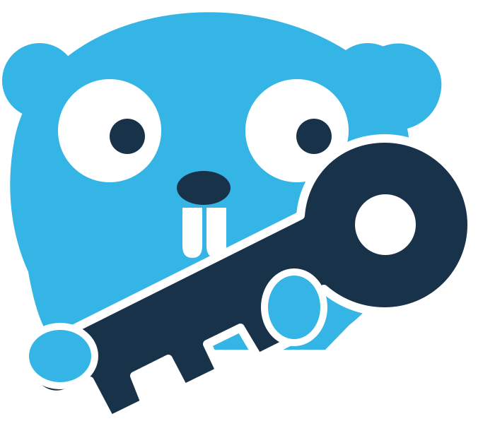

<p align="center">
  
</p>

<h1 align="center">Keymaker</h1>

<p align="center">
  <a href="https://github.com/kentrow/keymaker/actions/workflows/ci.yml"></a>
  <a href="https://github.com/kentrow/keymaker/releases/latest"></a>
  <a href="LICENSE"></a>
</p>

<p align="center">
  A local web interface to inventory, audit, revoke and create OVHcloud API keys.
</p>

<p align="center">
  English · <a href="README.fr.md">Français</a>
</p>

> [!IMPORTANT]
> Keymaker is an independent project. It is not affiliated with, endorsed by or sponsored by
> OVHcloud. OVHcloud is a trademark of its owner, used here only to identify the API this
> tool works with.

## Features

Keymaker works with classic OVHcloud API keys: an application key, an application secret and
a consumer key.

- **Inventory** of every key on the account, with its access rules, allowed addresses,
  creation, expiry and last use, and the application it belongs to, including applications
  the account does not own, such as the OVHcloud API console. The key Keymaker itself uses is
  marked.
- **Audit** that flags keys reaching the whole account, working from any address, never
  expiring, never used, dormant for six months, or without a description, and sorts them into
  "at risk", "to watch" and "nothing flagged".
- **Route explorer** over the whole published API, searchable by route or by purpose, to
  build a set of access rules, with a warning when a rule reaches the whole account.
- **Key creation** through the OVHcloud `createToken` page, opened with the chosen rules
  already filled in. The values of the new key never pass through Keymaker.
- **Replacement** of a key whose rules no longer fit, since the API cannot change the rules of
  an existing key. The rules of the old key are the starting point, its allowed addresses are
  listed to be entered again, and revoking it is the last step.
- **Revocation** behind typing the key's identifier, refused for the key Keymaker uses, and in
  one pass for every expired or refused key.
- **Nothing written to disk**: no database, no cache, and a configuration file mounted
  read-only.
- English and French interface, light and dark themes, list and card layouts.

## Security model

In short, with the details in [docs/ARCHITECTURE.md](docs/ARCHITECTURE.md#security-model) and
the reporting policy in [SECURITY.md](SECURITY.md):

- Keymaker is a local, single-user tool. Anyone who can reach the interface can act with its
  management key, so it listens on `127.0.0.1` and the container port must be published on
  `127.0.0.1` only.
- A random access token is generated at every start and printed once in the address to open.
  Every route but `GET /healthz` requires it.
- Every change also requires a second token that other origins cannot read.
- The content security policy allows nothing the binary does not serve.
- The application secret and the consumer key are redacted from every log line.
- Nothing is persisted, and created keys never reach the process.
- The only hosts contacted are the OVHcloud API and, when you ask for your public address,
  `api.ipify.org`. `KEYMAKER_IP_LOOKUP=off` removes the latter.

## Quick start

### 1. Create the management key

Keymaker authenticates with a key of its own, which needs read access to your credentials and
applications:

```text
GET    /me/api/credential
GET    /me/api/credential/*
GET    /me/api/application/*
DELETE /me/api/credential/*
```

The `DELETE` rule is optional. Without it Keymaker runs read-only and says on each key why
revocation is not offered. Never grant this key `/me/*` or `/*`.

For the `ovh-eu` endpoint, this link opens the OVHcloud page with those rules filled in:

<https://eu.api.ovh.com/createToken/?GET=/me/api/credential&GET=/me/api/credential/*&GET=/me/api/application/*&DELETE=/me/api/credential/*>

For `ovh-ca` and `ovh-us`, use the same path on `ca.api.ovh.com` or `api.us.ovhcloud.com`.
Keymaker also offers the right link for its endpoint whenever the API refuses its key.

### 2. Write `ovh.conf`

```ini
[default]
endpoint=ovh-eu

[ovh-eu]
application_key=<application key>
application_secret=<application secret>
consumer_key=<consumer key>
```

[`ovh.conf.example`](ovh.conf.example) is this file with every value explained. Keep the file
out of version control and readable by you alone:

```bash
cp ovh.conf.example ovh.conf
chmod 600 ovh.conf
```

### 3. Run the container

```bash
docker run --rm \
  -p 127.0.0.1:8080:8080 \
  --user "$(id -u):$(id -g)" \
  -v ./ovh.conf:/config/ovh.conf:ro \
  --read-only \
  --cap-drop=ALL \
  --security-opt no-new-privileges \
  ghcr.io/kentrow/keymaker:0.1.0
```

The process prints one address, token included. Open it: the token moves into a session cookie
and disappears from the address bar. Stopping the process ends the session.

`--user` runs the container as you, so it can read an `ovh.conf` that only you can read. The
image otherwise runs as its own unprivileged user.

### Or with Docker Compose

```yaml
# compose.yaml
services:
  keymaker:
    image: ghcr.io/kentrow/keymaker:0.1.0
    user: "${KEYMAKER_UID:?run export KEYMAKER_UID=$(id -u)}:${KEYMAKER_GID:?run export KEYMAKER_GID=$(id -g)}"
    ports:
      - "127.0.0.1:8080:8080"
    volumes:
      - ./ovh.conf:/config/ovh.conf:ro
    read_only: true
    cap_drop:
      - ALL
    security_opt:
      - no-new-privileges:true
```

```bash
export KEYMAKER_UID=$(id -u) KEYMAKER_GID=$(id -g)
docker compose up
```

## Configuration

### `ovh.conf`

The file follows the format the official OVHcloud SDKs read. `endpoint` in `[default]` names
the section to use, and must be `ovh-eu`, `ovh-ca` or `ovh-us`. Keymaker reads only the file it
is given: it ignores `~/.ovh.conf`, `/etc/ovh.conf` and the `OVH_*` environment variables.

### Environment variables

| Variable | Default | Purpose |
|---|---|---|
| `KEYMAKER_CONFIG` | `/config/ovh.conf` | Path to the configuration file, opened read-only. |
| `KEYMAKER_ADDR` | `127.0.0.1:8080` for the binary, `0.0.0.0:8080` in the image | Listen address. Any address other than loopback logs a warning. |
| `KEYMAKER_PUBLIC_URL` | derived from the listen address | Address the interface is reached on, used to print the startup link. Set it when the published port differs from 8080, for example `http://127.0.0.1:9000`. |
| `KEYMAKER_IP_LOOKUP` | enabled | `off` removes the public address lookup, so the OVHcloud API is the only host contacted. |
| `KEYMAKER_LOG_LEVEL` | `info` | `debug`, `info`, `warn` or `error`. `debug` adds one line per request, without its query string. |

### Flags

| Flag | Purpose |
|---|---|
| `--version` | Print the version, commit and build date, then exit. |

### Health check

`GET /healthz` answers `ok` without the access token, for orchestrators and probes. The image
has no shell, so it declares no `HEALTHCHECK` of its own.

## Building from source

Requirements: Go (the version in [`go.mod`](go.mod)), Docker, and
[golangci-lint](https://golangci-lint.run/) for `make lint`.

```bash
make help     # list the targets
make build    # build ./bin/keymaker
make test     # run the tests with the race detector
make lint     # gofmt, go mod tidy and golangci-lint
make vuln     # govulncheck
make docker   # build the image for the local platform
```

Run the binary against your configuration:

```bash
KEYMAKER_CONFIG=./ovh.conf ./bin/keymaker
```

## Documentation

- [docs/ARCHITECTURE.md](docs/ARCHITECTURE.md): how Keymaker is built and what it calls
- [CONTRIBUTING.md](CONTRIBUTING.md): how to contribute
- [SECURITY.md](SECURITY.md): security policy and vulnerability reporting
- [CHANGELOG.md](CHANGELOG.md): release notes
- [CODE_OF_CONDUCT.md](CODE_OF_CONDUCT.md): community guidelines

## License

Keymaker is licensed under the [Apache License 2.0](LICENSE). Third-party components and
attributions are listed in [NOTICE](NOTICE).

The Keymaker mascot is licensed under the Creative Commons Attribution 4.0 license. It was
inspired by the Go gopher, designed by [Renee French](https://reneefrench.blogspot.com/),
whose artwork is licensed under the
[Creative Commons Attribution 4.0](https://go.dev/blog/gopher) license. The icons come from
[Lucide](https://lucide.dev), under the ISC license.
